# AI Visualizer Prompt

This prompt provides instructions for an AI to analyze the OCaml email scheduler codebase and update the interactive visualizer.

## Context

You are analyzing an OCaml-based email scheduling system that manages automated email and SMS campaigns. The system handles anniversary-based emails (birthdays, policy effective dates), campaign-based emails, state-specific exclusion windows, and processes up to 3 million contacts efficiently.

## Task

Update the interactive visualizer (`interactive_scheduler_fixed.html`) to reflect the current state of the codebase by:

1. **Analyzing the OCaml code** in the `lib/` directory
2. **Extracting function signatures, documentation, and relationships**
3. **Updating the visualizer** with accurate information

## Codebase Structure

```
lib/
├── db/
│   ├── database.ml      # Database operations using Caqti
│   └── database.mli     # Database interface
├── domain/
│   ├── contact.ml       # Contact operations and validation
│   └── types.ml         # Core type definitions (states, email types, contacts)
├── rules/
│   ├── dsl.ml          # Domain-specific language for rules
│   └── exclusion_window.ml # Exclusion window calculations
├── scheduling/
│   ├── date_calc.ml     # Date calculations and timezone handling
│   ├── email_scheduler.ml # Main scheduling algorithm
│   └── load_balancer.ml # Load distribution logic
└── utils/
    ├── audit_simple.ml  # Audit logging
    ├── config.ml        # Configuration management
    ├── date_time.ml     # Date/time utilities
    ├── simple_date.ml   # Simple date operations
    └── zip_data.ml      # ZIP code data handling
```

## Analysis Steps

### 1. Extract Function Information

For each `.ml` file, extract:

```ocaml
(* Function signature *)
let function_name param1 param2 = ...

(* Documentation comments *)
(** Purpose: Brief description
    Parameters: 
      - param1: Description
      - param2: Description
    Returns: Description
    Business Logic: Key logic points *)
```

### 2. Identify Function Categories

Group functions into these categories:

- **🎯 Main Orchestration**: Top-level entry points
- **📧 Campaign Processing**: Campaign-related logic  
- **🎂 Anniversary Processing**: Birthday/effective date emails
- **🚫 Business Rules & Validation**: Exclusion rules and validation
- **⚖️ Post-Processing & Load Balancing**: Frequency limits, conflicts, load balancing
- **💾 Database Operations**: Database queries and updates

### 3. Map Function Relationships

Identify which functions call which other functions to create accurate flow diagrams.

### 4. Update Visualizer Structure

The visualizer uses this structure:

```javascript
const functionData = {
    'function_name': {
        name: 'function_name',
        file: 'lib/path/to/file.ml',
        lines: 'start-end',  // Approximate line numbers
        signature: 'let function_name param1 param2 =',
        documentation: `Purpose: ...
Parameters: ...
Returns: ...
Business Logic: ...`,
        code: `let function_name param1 param2 =
  (* actual OCaml code implementation *)
  ...`
    }
};
```

## Key Functions to Focus On

### Main Orchestration
- `schedule_emails_streaming` - Main entry point
- `create_context` - Context initialization
- `manage_campaign_lifecycle` - Campaign status management

### Campaign Processing  
- `calculate_all_campaign_schedules` - Process all campaigns
- `calculate_campaign_emails` - Individual campaign logic
- `get_active_campaign_instances` - Database retrieval
- `get_campaign_type_config` - Configuration retrieval

### Anniversary Processing
- `calculate_schedules_for_contact` - Main contact processing
- `calculate_anniversary_emails` - Birthday/effective date logic
- `next_anniversary` - Date calculations
- `should_send_effective_date_email` - Business logic

### Business Rules
- `check_exclusion_window` - Main exclusion check
- `is_contact_valid_for_scheduling` - Contact validation
- `should_exclude_contact` - Exclusion logic
- `should_skip_email` - Skip decisions

### Load Balancing
- `distribute_schedules` - Main load balancer
- `apply_frequency_limits` - Email frequency control
- `resolve_campaign_conflicts` - Priority resolution
- `smooth_effective_dates` - Date distribution
- `enforce_daily_caps` - Volume limits

### Database Operations
- `smart_batch_insert_schedules` - Smart updates
- `get_existing_schedules_for_comparison` - Data retrieval
- `find_existing_schedule` - Record matching
- `schedule_content_changed` - Change detection

## Mermaid Diagram Structure

Update the Mermaid flowcharts for each function group:

```mermaid
%%{init: {'theme': 'dark', 'flowchart': {'defaultRenderer': 'elk'}}}%%
flowchart TB
    MAIN[main_function<br/>📧 Description]:::main
    SUB1[sub_function_1<br/>🔧 Description]:::helper
    SUB2[sub_function_2<br/>📊 Description]:::helper
    
    MAIN --> SUB1
    MAIN --> SUB2
    
    classDef main fill:#ff6b6b,stroke:#fff,stroke-width:3px,color:#fff
    classDef helper fill:#4ecdc4,stroke:#fff,stroke-width:2px,color:#fff
```



## Output Format

Update the `interactive_scheduler_fixed.html` file by:

1. **Adding new functions** to the appropriate function groups
2. **Updating existing function data** with current signatures and documentation  
3. **Modifying Mermaid diagrams** to reflect actual function relationships
4. **Ensuring accuracy** of file paths and line numbers
5. **Maintaining consistent styling** and structure

## Validation Checklist

- [ ] All major functions from the codebase are represented
- [ ] Function signatures match the actual OCaml code
- [ ] Mermaid diagrams show accurate function relationships  
- [ ] Function groupings make logical sense
- [ ] File paths and line numbers are approximately correct
- [ ] Documentation explains business logic clearly
- [ ] Code examples are realistic OCaml implementations

## Business Context

Remember this is an **email scheduling system** with these key concerns:

- **Regulatory Compliance**: State-specific exclusion windows
- **Performance**: Processing millions of contacts efficiently  
- **Accuracy**: Correct timing for anniversary emails
- **Business Rules**: Priority handling, frequency limits, conflict resolution
- **Audit Trail**: Maintaining history of scheduling decisions
- **Load Balancing**: Distributing email volume evenly

The visualizer should help developers understand how these business requirements are implemented in the code structure.