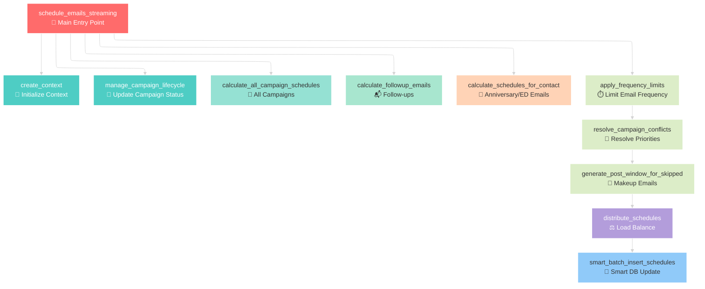
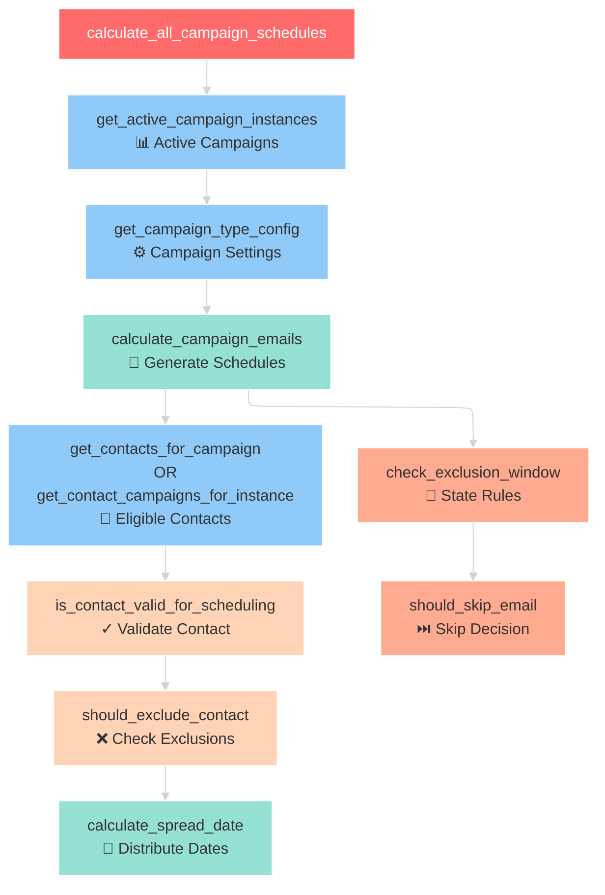
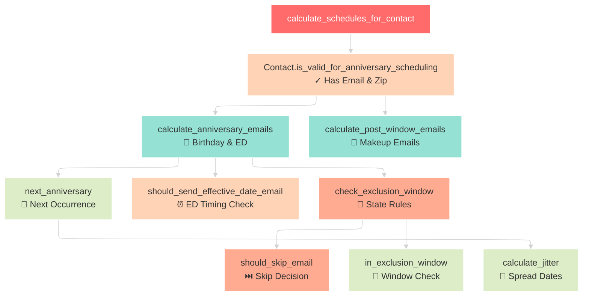
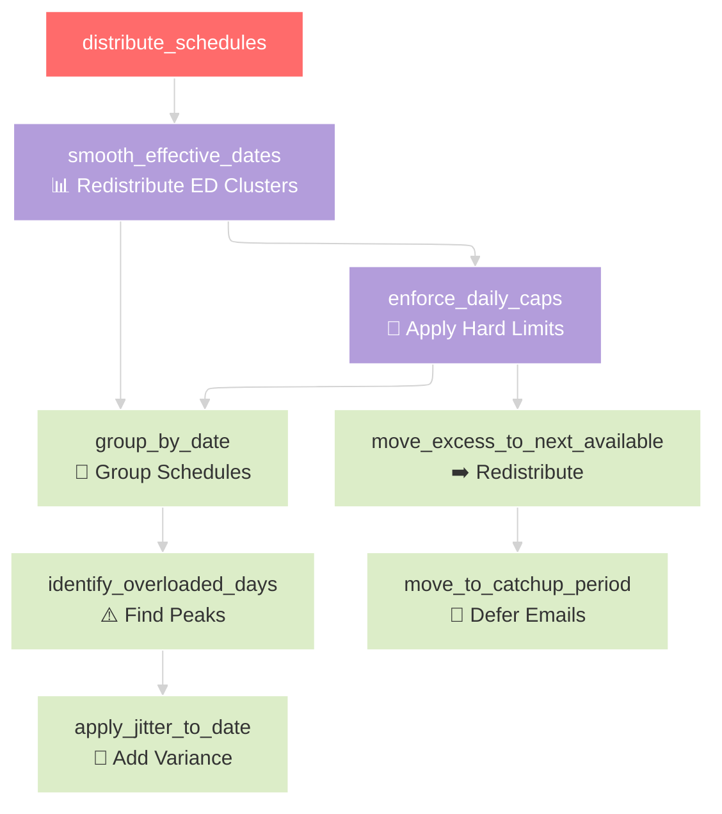
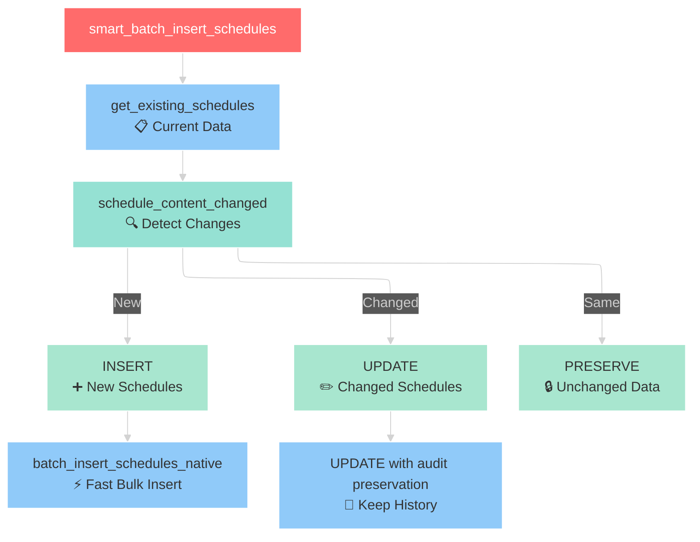
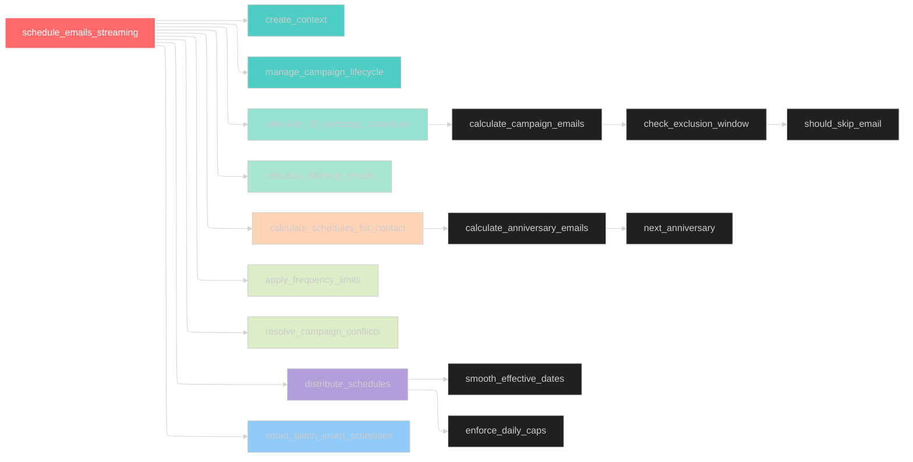

# Email Scheduler Flow Diagram

## Main Scheduler Flow

## Campaign Scheduling Detail

## Anniversary Email Flow

## Load Balancing Pipeline

## Database Update Strategy

## Key Function Dependencies

## Legend

- 🔴 **Entry Points**: Main functions that start processes
- 🔵 **Database Operations**: Functions that interact with the database
- 🟢 **Processing Functions**: Core business logic
- 🟡 **Validation Functions**: Input validation and checks
- 🟣 **Load Balancing**: Distribution and optimization
- 🟠 **Business Rules**: Exclusion windows and compliance
- ⚪ **Utility Functions**: Supporting calculations

This diagram shows the complete flow of the email scheduler from entry point through all major processing steps to final database update.