# Email Scheduler Flow Diagram

## Main Scheduler Flow

```mermaid
%%{init: {'theme': 'dark', 'flowchart': {'defaultRenderer': 'elk', 'nodeSpacing': 100, 'rankSpacing': 80}}}%%
flowchart TB
    %% Entry Point
    MAIN[schedule_emails_streaming<br/>📧 Main Entry Point]:::entry
    
    %% Context and Setup
    CONTEXT[create_context<br/>🔧 Initialize Context]:::setup
    LIFECYCLE[manage_campaign_lifecycle<br/>🔄 Update Campaign Status]:::setup
    
    %% Core Scheduling Branches
    CAMPAIGN_ALL[calculate_all_campaign_schedules<br/>📅 All Campaigns]:::campaign
    FOLLOWUP[calculate_followup_emails<br/>📬 Follow-ups]:::followup
    ANNIVERSARY[calculate_schedules_for_contact<br/>🎂 Anniversary/ED Emails]:::anniversary
    
    %% Post Processing
    FREQ_LIMIT[apply_frequency_limits<br/>⏱️ Limit Email Frequency]:::postprocess
    CONFLICTS[resolve_campaign_conflicts<br/>🔀 Resolve Priorities]:::postprocess
    POST_WINDOW[generate_post_window_for_skipped<br/>🔁 Makeup Emails]:::postprocess
    DISTRIBUTE[distribute_schedules<br/>⚖️ Load Balance]:::loadbalance
    
    %% Database
    SMART_UPDATE[smart_batch_insert_schedules<br/>💾 Smart DB Update]:::database
    
    %% Main Flow
    MAIN --> CONTEXT
    MAIN --> LIFECYCLE
    MAIN --> CAMPAIGN_ALL
    MAIN --> FOLLOWUP
    MAIN --> ANNIVERSARY
    MAIN --> FREQ_LIMIT
    FREQ_LIMIT --> CONFLICTS
    CONFLICTS --> POST_WINDOW
    POST_WINDOW --> DISTRIBUTE
    DISTRIBUTE --> SMART_UPDATE
    
    %% Styling
    classDef entry fill:#ff6b6b,stroke:#fff,stroke-width:3px,color:#fff
    classDef setup fill:#4ecdc4,stroke:#fff,stroke-width:2px,color:#fff
    classDef campaign fill:#95e1d3,stroke:#fff,stroke-width:2px,color:#333
    classDef followup fill:#a8e6cf,stroke:#fff,stroke-width:2px,color:#333
    classDef anniversary fill:#ffd3b6,stroke:#fff,stroke-width:2px,color:#333
    classDef postprocess fill:#dcedc8,stroke:#fff,stroke-width:2px,color:#333
    classDef loadbalance fill:#b39ddb,stroke:#fff,stroke-width:2px,color:#fff
    classDef database fill:#90caf9,stroke:#fff,stroke-width:2px,color:#333
```

## Campaign Scheduling Detail

## Anniversary Email Flow

```mermaid
%%{init: {'theme': 'dark', 'flowchart': {'defaultRenderer': 'elk'}}}%%
flowchart TB
    %% Anniversary Main
    ANNIV_MAIN[calculate_schedules_for_contact]:::main
    
    %% Validation
    VALID[Contact.is_valid_for_anniversary_scheduling<br/>✓ Has Email & Zip]:::validate
    
    %% Anniversary Processing
    CALC_ANNIV[calculate_anniversary_emails<br/>🎂 Birthday & ED]:::process
    CALC_POST[calculate_post_window_emails<br/>🔁 Makeup Emails]:::process
    
    %% Sub-functions
    NEXT_ANNIV[next_anniversary<br/>📅 Next Occurrence]:::calc
    SHOULD_SEND_ED[should_send_effective_date_email<br/>⏰ ED Timing Check]:::validate
    CHECK_EXCL[check_exclusion_window<br/>🚫 State Rules]:::rules
    SKIP[should_skip_email<br/>⏭️ Skip Decision]:::rules
    
    %% Date Calculations
    IN_WINDOW[in_exclusion_window<br/>📅 Window Check]:::calc
    CALC_JITTER[calculate_jitter<br/>🎲 Spread Dates]:::calc
    
    %% Flow
    ANNIV_MAIN --> VALID
    VALID --> CALC_ANNIV
    VALID --> CALC_POST
    CALC_ANNIV --> NEXT_ANNIV
    CALC_ANNIV --> SHOULD_SEND_ED
    CALC_ANNIV --> CHECK_EXCL
    CHECK_EXCL --> SKIP
    CHECK_EXCL --> IN_WINDOW
    NEXT_ANNIV --> CALC_JITTER
    
    %% Styling
    classDef main fill:#ff6b6b,stroke:#fff,stroke-width:3px,color:#fff
    classDef validate fill:#ffd3b6,stroke:#fff,stroke-width:2px,color:#333
    classDef process fill:#95e1d3,stroke:#fff,stroke-width:2px,color:#333
    classDef rules fill:#ffab91,stroke:#fff,stroke-width:2px,color:#333
    classDef calc fill:#dcedc8,stroke:#fff,stroke-width:2px,color:#333
```

## Load Balancing Pipeline

```mermaid
%%{init: {'theme': 'dark', 'flowchart': {'defaultRenderer': 'elk'}}}%%
flowchart TB
    %% Load Balance Main
    DIST_MAIN[distribute_schedules]:::main
    
    %% Two-Phase Balancing
    SMOOTH[smooth_effective_dates<br/>📊 Redistribute ED Clusters]:::balance
    ENFORCE[enforce_daily_caps<br/>🚦 Apply Hard Limits]:::balance
    
    %% Sub-functions
    GROUP_DATE[group_by_date<br/>📅 Group Schedules]:::process
    IDENTIFY[identify_overloaded_days<br/>⚠️ Find Peaks]:::process
    APPLY_JITTER[apply_jitter_to_date<br/>🎲 Add Variance]:::process
    MOVE_EXCESS[move_excess_to_next_available<br/>➡️ Redistribute]:::process
    CATCHUP[move_to_catchup_period<br/>📆 Defer Emails]:::process
    
    %% Flow
    DIST_MAIN --> SMOOTH
    SMOOTH --> ENFORCE
    SMOOTH --> GROUP_DATE
    GROUP_DATE --> IDENTIFY
    IDENTIFY --> APPLY_JITTER
    ENFORCE --> GROUP_DATE
    ENFORCE --> MOVE_EXCESS
    MOVE_EXCESS --> CATCHUP
    
    %% Styling
    classDef main fill:#ff6b6b,stroke:#fff,stroke-width:3px,color:#fff
    classDef balance fill:#b39ddb,stroke:#fff,stroke-width:2px,color:#fff
    classDef process fill:#dcedc8,stroke:#fff,stroke-width:2px,color:#333
```

## Database Update Strategy

```mermaid
%%{init: {'theme': 'dark', 'flowchart': {'defaultRenderer': 'elk'}}}%%
flowchart TB
    %% Smart Update Main
    UPDATE_MAIN[smart_batch_insert_schedules]:::main
    
    %% Comparison Logic
    GET_EXIST[get_existing_schedules<br/>📋 Current Data]:::database
    COMPARE[schedule_content_changed<br/>🔍 Detect Changes]:::process
    
    %% Update Branches
    INSERT[INSERT<br/>➕ New Schedules]:::action
    UPDATE[UPDATE<br/>✏️ Changed Schedules]:::action
    PRESERVE[PRESERVE<br/>🔒 Unchanged Data]:::action
    
    %% Batch Operations
    BATCH_INSERT[batch_insert_schedules_native<br/>⚡ Fast Bulk Insert]:::database
    BATCH_UPDATE[UPDATE with audit preservation<br/>📝 Keep History]:::database
    
    %% Flow
    UPDATE_MAIN --> GET_EXIST
    GET_EXIST --> COMPARE
    COMPARE -->|New| INSERT
    COMPARE -->|Changed| UPDATE
    COMPARE -->|Same| PRESERVE
    INSERT --> BATCH_INSERT
    UPDATE --> BATCH_UPDATE
    
    %% Styling
    classDef main fill:#ff6b6b,stroke:#fff,stroke-width:3px,color:#fff
    classDef database fill:#90caf9,stroke:#fff,stroke-width:2px,color:#333
    classDef process fill:#95e1d3,stroke:#fff,stroke-width:2px,color:#333
    classDef action fill:#a8e6cf,stroke:#fff,stroke-width:2px,color:#333
```

## Key Function Dependencies

## Legend

- 🔴 **Entry Points**: Main functions that start processes
- 🔵 **Database Operations**: Functions that interact with the database
- 🟢 **Processing Functions**: Core business logic
- 🟡 **Validation Functions**: Input validation and checks
- 🟣 **Load Balancing**: Distribution and optimization
- 🟠 **Business Rules**: Exclusion windows and compliance
- ⚪ **Utility Functions**: Supporting calculations

This diagram shows the complete flow of the email scheduler from entry point through all major processing steps to final database update.